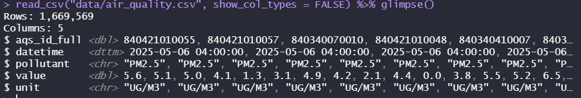
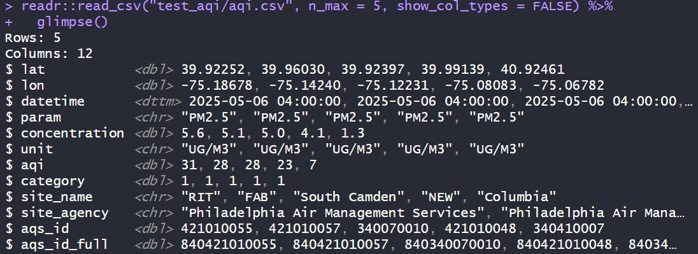
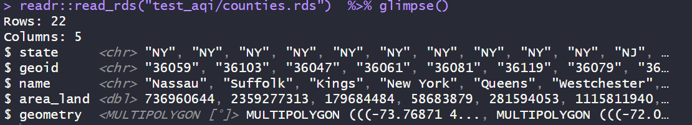
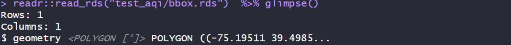
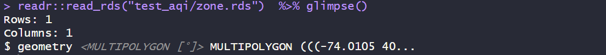
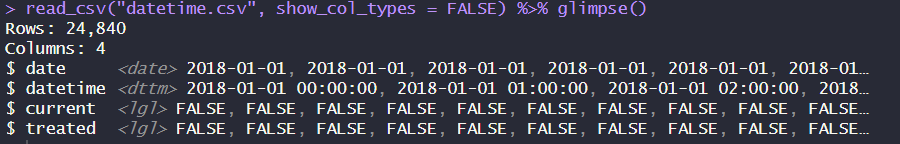
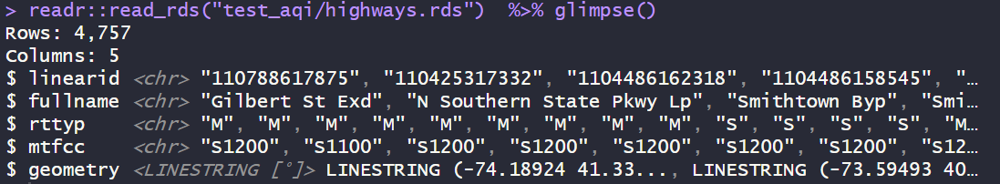
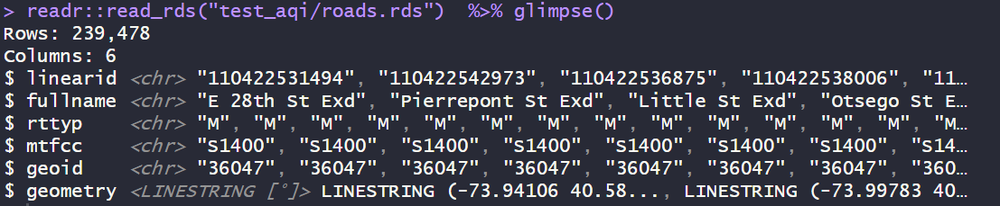
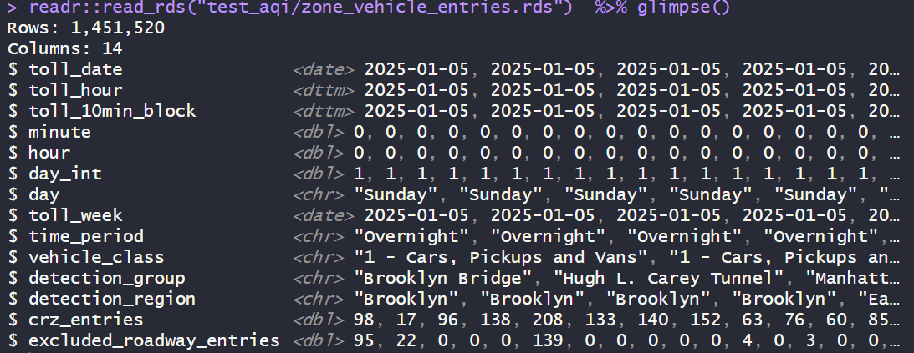
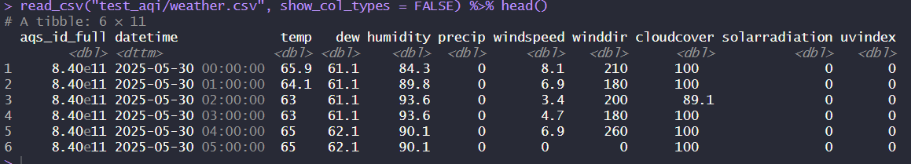

# README `/data/`

This folder contains scripts for **generating data** for our study and experiment.

### 📑 Table of Contents

-   **📚[Summary](#summary)**

    -   📊 [Useful Data](#useful-data)

    -   📂[Useful Files](#useful-files)

    -   💻[Useful Scripts](#useful-scripts)

<!-- -->

-   🧠[**Codebook**](#codebook)

    -   🌫️ [air_quality.csv](#air-quality) — Air Quality Index scores and pollutant concentrations per hour, finalized, including Danni's NYC data

    -   🌫️ [aqi.csv](#aqicsv) — Air Quality Index scores and pollutant concentrations per hour

    -   📡[sites.rds](#sitesrds) - Air Quality Sensor Locations

    -   🏙️ [metro.rds](#metrords) — NYC Metro Counties

    -   🗺️ [counties.rds](#countiesrds) — County Boundaries & Land Area

    -   🔲 [bbox.rds](#bboxrds) — NYC Metro Bounding Box

    -   🚧 [zone.rds](#zonerds) — Congestion Relief Zone Boundary

    -   🕓 [datetime.csv](#datetimecsv) — Policy Timetable and Treated Flags

    -   🛣️ [highways.rds](#highwaysrds) — Major Highways (TIGRIS)

    -   🚦 [roads.rds](#roadsrds) — Local Roads (TIGRIS)

    -   🚗 [zone_vehicle_entries.rds](#zone_vehicle_entriesrds) — Vehicle Entries into Congestion Zone

    -   🌦️ [weather.csv](#weathercsv) — Hourly Weather per Sensor (Visual Crossing)

------------------------------------------------------------------------

## **📚**Summary {#summary}

[](images/clipboard-490080029.png)](https://congestionreliefzone.mta.info/)

### 📊**Useful Data** {#useful-data}

-   `metro.rds`: dataframe of county names and geoids in the greater New York Metro statistical area.
-   `sites.rds`: spatial dataframe of air quality sensors reporting PM2.5 between 2019 and 2025.
-   `zone.rds`: spatial dataframe of congestion relief zone polygon.
-   `counties.rds`: spatial dataframe of counties in the greater New York Metro statistical area.
-   `bbox.rds`: spatial dataframe for bounding box of New York Metro statistical area, used for API queries.
-   `bbox_nums.rds`: numeric bounding box
-   `highways.rds`: spatial dataframe of all highways (primary and secondary roads) in the bounding box, sourced from TIGRIS.
-   `roads.rds`: spatial dataframe of all roads in the metro area, sourced from TIGRIS.
-   `zone_vehicle_entries.rds`: time-series entries of total vehicle entries into the congestion relief zone per 10-min block per **vehicle class**.

### **Useful Files** {#useful-files}

-   `aqi.csv`: very large dataframe of PM2.5 related concentrations and AQI scores, for all sensors in `sites.rds`.
    -   includes **current era** 2024-01-01 to 2025-06-01 and **pandemic era** 2018-01-01 to 2019-06-01
    -   a handful of negative values are data errors.
    -   Suggest that when you load it in, you always filter intentionally to just valid rows.

``` r
library(dplyr)
library(readr)
read_csv("data/aqi.csv") %>%
  filter(concentration >= 0) %>%
  filter(datetime >= "2024-01-01")
```

-   `study_region.png`: a map of the study region, made in `fig_map.R`
-   `map_sensors.png`: a map of sensors in the study region, made in `fig_map.R`

### **Useful Scripts** {#useful-scripts}

-   `fig_map.R`: script for simple mapping
-   `aqi_collect.R`: script to run API requests in bulk. (Already done. Can skip.)
-   `functions.R`: required functions for `aqi_collect.R`, etc.
-   `get_dependencies.R`: script for downloading core dependencies, like geospatial data.

------------------------------------------------------------------------

## Prerequisites

Be sure to load these packages before trying to work with the data below. Some are written in `sf` spatial features format and will not preview correctly otherwise. Many are saved as compressed R Data Storage `.rds` files to conserve space and retain all column formats.

``` r
library(dplyr) # for data wrangling
library(readr) # for reading data
library(sf) # for spatial features
library(lubridate) # for date-time formatting
```

------------------------------------------------------------------------

## 🧠Codebooks

See below for a set of codebooks, one per relevant dataset. Codebooks were generated with AI; if any errors are spotted, please let the repository maintainer know.

### 🌫️`air_quality.csv`

This dataset contains hourly air quality measurements collected from various monitoring sites in the Philadelphia and New Jersey region. Each row represents a single observation at a specific time and location. Includes both AIRNOW API and NYC PM2.5 monitoring stations.



#### Variable Descriptions

| Variable | Type | Description |
|----|----|----|
| `aqs_id_full` | `double` | AQS (Air Quality System) site ID — a unique numeric identifier. For \~20 NYC sites not in AIRNOW system, follows format [\`8409999999XX\`]. |
| `datetime` | `POSIXct` | Timestamp of the observation (UTC time zone assumed unless otherwise noted). |
| `pollutant` | `character` | Air quality parameter being measured. For this dataset, always `"PM2.5"` (particulate matter ≤2.5 µm). |
| `value` | `double` | Measured value of the pollutant, in the units of the `unit` column. |
| `unit` | `character` | Unit of the value. `"UG/M3"` (micrograms per cubic meter) or "AQI", etc. |

#### Notes

-   Time granularity is **hourly**.
-   The AQI values are derived from the `concentration` using EPA standard conversion tables.
-   Refined version of `aqi.csv` that contains all air quality data. **USE THIS IN ANALYSES**.

------------------------------------------------------------------------

### 🌫️`aqi.csv`

This dataset contains hourly air quality measurements (specifically PM2.5) collected from various monitoring sites in the Philadelphia and New Jersey region. Each row represents a single observation at a specific time and location.



#### Variable Descriptions

| Variable | Type | Description |
|----|----|----|
| `lat` | `double` | Latitude of the monitoring site (WGS84 projection). |
| `lon` | `double` | Longitude of the monitoring site (WGS84 projection). |
| `datetime` | `POSIXct` | Timestamp of the observation (UTC time zone assumed unless otherwise noted). |
| `param` | `character` | Air quality parameter being measured. For this dataset, always `"PM2.5"` (particulate matter ≤2.5 µm). |
| `concentration` | `double` | Measured concentration of the parameter, in micrograms per cubic meter (µg/m³). |
| `unit` | `character` | Unit of the concentration value. Always `"UG/M3"` (micrograms per cubic meter). |
| `aqi` | `double` | Calculated Air Quality Index (AQI) corresponding to the concentration level. |
| `category` | `double` | Numeric AQI category. Follows EPA AQI scale: 1 = Good, 2 = Moderate, etc. |
| `site_name` | `character` | Name of the monitoring site. |
| `site_agency` | `character` | Name of the agency operating the monitoring site. |
| `aqs_id` | `double` | AQS (Air Quality System) site ID — a unique numeric identifier. |
| `aqs_id_full` | `double` | Full AQS site identifier, including country code prefix (`840` = USA). |

#### Notes

-   All PM2.5 readings are in µg/m³ and follow EPA calibration and QA protocols.
-   Time granularity is **hourly**.
-   The AQI values are derived from the `concentration` using EPA standard conversion tables.
-   For more on AQI categories: [EPA AQI Guide](https://www.airnow.gov/aqi/aqi-basics/)

------------------------------------------------------------------------

### 📡`sites.rds`

This dataset contains metadata and geospatial information about air quality monitoring sites used in the associated air quality measurements (`aqi.csv`). Each row represents a single monitoring location.


#### Variable Descriptions

| Variable | Type | Description |
|----|----|----|
| `aqs_id` | `character` | AQS (Air Quality System) site ID — unique identifier assigned by the EPA. |
| `aqs_id_full` | `double` | Full AQS site identifier, including U.S. country code prefix (`840`). |
| `site_name` | `character` | Short name or label for the monitoring site. |
| `site_agency` | `character` | Name of the agency responsible for operating the site. |
| `geometry` | `POINT [°]` | Spatial coordinates of the site in longitude and latitude (WGS84 projection), represented as a point geometry. |
| `dist` | `double` | Distance from nearest boundary of congestion relief zone (in kilometers). |

#### Notes

-   This dataset is typically used to map, filter, or label air quality sensor locations.
-   The `geometry` column may require geospatial packages (`sf` or `sp`) for proper interpretation.
-   `dist` is useful for nearest-neighbor queries or spatial subsetting.

------------------------------------------------------------------------

### 🏙️`metro.rds`

This dataset defines the set of counties that make up the New York City metropolitan area used in the air quality analysis.

#### Variable Descriptions

| Variable | Type | Description |
|----|----|----|
| `state` | `character` | U.S. state abbreviation (e.g., `"NY"`, `"NJ"`). |
| `county` | `character` | County name (e.g., `"Kings County"`). |
| `geoid` | `character` | FIPS-based geographic identifier (GEOID) for the county, used for joining with other datasets. |

#### Notes

-   The `geoid` is a 5-digit FIPS code commonly used in Census and EPA datasets.
-   This dataset can be used as a filter or spatial region definition for metropolitan-level aggregations.

------------------------------------------------------------------------

### 🗺️`counties.rds`

This dataset contains geospatial boundary data and metadata for counties in the analysis region (primarily NYC metro area and adjacent counties).



#### Variable Descriptions

| Variable | Type | Description |
|----|----|----|
| `state` | `character` | U.S. state abbreviation (e.g., `"NY"`, `"NJ"`). |
| `geoid` | `character` | FIPS-based geographic identifier (GEOID) for the county. |
| `name` | `character` | County name without "County" suffix. |
| `area_land` | `double` | Land area of the county in square meters. |
| `geometry` | `MULTIPOLYGON [°]` | Spatial polygon geometry of the county boundaries (WGS84 projection). |

#### Notes

-   This dataset is useful for mapping and spatial analysis.
-   The `geometry` column is compatible with geospatial packages such as `sf`.
-   `area_land` can be used to normalize emissions or population density calculations.

------------------------------------------------------------------------

### 🔲`bbox.rds`

This dataset defines the bounding box for the NYC metropolitan area used to spatially filter or clip other geospatial datasets.



#### Variable Descriptions

| Variable | Type | Description |
|----|----|----|
| `geometry` | `POLYGON [°]` | A rectangular polygon in WGS84 coordinates representing the spatial extent of the NYC metro area (covering all counties listed in `counties.rds`). |

#### Notes

-   Typically used to crop larger datasets (e.g., national road networks) down to the study region.
-   Coordinate Reference System (CRS): WGS84 (EPSG:4326).

### 🚧`zone.rds`

This dataset defines the polygon boundary for the NYC Congestion Relief Zone.



#### Variable Descriptions

| Variable | Type | Description |
|----|----|----|
| `geometry` | `MULTIPOLYGON [°]` | The official boundary of the congestion relief or tolling zone within NYC, represented as one or more polygons in WGS84 coordinates. |

#### Notes

-   Can be used to mask or extract road or sensor features within the congestion pricing area.
-   Useful for spatial comparisons (inside vs outside zone).

------------------------------------------------------------------------

### 🕓`datetimes.csv`

This file provides a complete hourly datetime reference table in `UTC` for time-based analysis, including flags for current and treatment periods aligned with NYC congestion pricing policy.

**Note: THESE DATES ARE IN UTC, NOT EST/EDT.** All datetimes in this project should be run in UTC to avoid confusion.



#### Variable Descriptions

| Variable | Type | Description |
|----|----|----|
| `date` | `date` | Calendar date (YYYY-MM-DD) in UTC. |
| `datetime` | `POSIXct` | Hour-level datetime in **UTC**. Used as the canonical time reference for all time joins. |
| `current` | `logical` | `TRUE` if the datetime is part of the 2024-2025 data period; `FALSE` if it is part of the `2018-2019` period. |
| `treated` | `logical` | `TRUE` if the datetime falls **on or after** the congestion pricing policy start: `2025-01-05 05:00:00 UTC` (i.e., `2025-01-05 00:00:00 EDT`). |

#### Notes

-   Covers hourly intervals from **2018-01-01 00:00:00 UTC** onward (24,840 rows).
-   All times are in **UTC** to maintain consistency across sources and ensure alignment with timestamped sensor data.
-   Policy implementation timestamp:\
    **Start of congestion pricing** = `2025-01-05 05:00:00 UTC`\
    Equivalent local time = `2025-01-05 00:00:00 EDT`
-   Useful for filtering or annotating time series data by policy regime (`treated`) or analysis window (`current`).

------------------------------------------------------------------------

### 🛣️`highways.rds`

This dataset includes TIGER/Line primary and secondary roads (major highways) within the NYC metropolitan area's bounding box.



#### Variable Descriptions

| Variable | Type | Description |
|----|----|----|
| `linearid` | `character` | Unique linear feature ID from the TIGER/Line shapefiles. |
| `fullname` | `character` | Full road or highway name (e.g., `"Southern State Pkwy"`). |
| `rttyp` | `character` | Road type classification (e.g., `"M"` for primary roads, `"S"` for secondary). |
| `mtfcc` | `character` | MAF/TIGER Feature Class Code (e.g., `"S1100"` for primary roads). |
| `geometry` | `LINESTRING [°]` | Spatial representation of the road segment. |

#### Notes

-   Data subset to fall within the bounding box from `bbox.rds`.
-   Focused on highways; excludes local streets.

------------------------------------------------------------------------

### 🚦`roads.rds`

This dataset includes all TIGER/Line road segments (including local streets) within the NYC metropolitan area counties.



#### Variable Descriptions

| Variable | Type | Description |
|----|----|----|
| `linearid` | `character` | Unique linear feature ID from the TIGER/Line shapefiles. |
| `fullname` | `character` | Full road or street name. |
| `rttyp` | `character` | Road type code (e.g., `"M"` for local road, `"S"` for secondary). |
| `mtfcc` | `character` | MAF/TIGER Feature Class Code (e.g., `"S1400"` for local neighborhood roads). |
| `geoid` | `character` | FIPS GEOID of the county containing the road segment. |
| `geometry` | `LINESTRING [°]` | Spatial geometry of the road segment (WGS84 projection). |

#### Notes

-   Larger and more detailed than `highways.rds`, includes residential and minor roads.
-   Can be joined to `counties.rds` via `geoid` for mapping and filtering.

------------------------------------------------------------------------

### 🚗`zone_vehicle_entries.rds`

This dataset contains detailed traffic volume data for vehicles entering the NYC Congestion Relief Zone, grouped by vehicle class, location, and 10-minute time blocks since January 2025.



#### Variable Descriptions

| Variable | Type | Description |
|----|----|----|
| `toll_date` | `date` | Calendar date of entry (YYYY-MM-DD). |
| `toll_hour` | `POSIXct` | Hourly timestamp of entry (floored to hour). |
| `toll_10min_block` | `POSIXct` | Timestamp for 10-minute time block (rounded). |
| `minute` | `double` | Minute of the hour (0–59). |
| `hour` | `double` | Hour of the day (0–23). |
| `day_int` | `double` | Integer code for day of the week (1 = Sunday, 7 = Saturday). |
| `day` | `character` | Day of the week as string (e.g., `"Monday"`). |
| `toll_week` | `date` | First date of the week (Sunday), for grouping by week. |
| `time_period` | `character` | Time-of-day category (e.g., `"AM Peak"`, `"Overnight"`). |
| `vehicle_class` | `character` | FHWA-style class description (e.g., `"1 - Cars, Pickups and Vans"`). |
| `detection_group` | `character` | Specific detection location (e.g., `"Brooklyn Bridge"`). |
| `detection_region` | `character` | Borough or area associated with the detection group (e.g., `"Brooklyn"`). |
| `crz_entries` | `double` | Count of vehicle entries into the Congestion Relief Zone in this time/location/class. |
| `excluded_roadway_entries` | `double` | Vehicle entries detected on excluded roadways (not tolled but measured). |

#### Notes

-   Dataset has 1,451,520 rows: includes all 10-minute intervals since the start of January 2025.
-   Primary variable of interest: `crz_entries`.
-   Can be used to summarize daily/hourly traffic volume by region, road, or vehicle class.
-   Data aligned to official congestion pricing boundaries defined in `zone.rds`.

------------------------------------------------------------------------

### 🌦️`weather.csv`

This dataset provides **hourly weather observations** at the sensor level using data from the Visual Crossing API (U.S. metric units). It includes meteorological conditions relevant to air quality and transportation exposure modeling.



#### Variable Descriptions

| Variable | Type | Description |
|----|----|----|
| `aqs_id_full` | `dbl` | Full AQS sensor site ID, uniquely identifying the monitoring location. |
| `datetime` | `POSIXct` | UTC timestamp of the weather observation (hourly resolution). |
| `temp` | `dbl` | Air temperature (°F) at the time of observation. |
| `dew` | `dbl` | Dew point temperature (°F). |
| `humidity` | `dbl` | Relative humidity (%). |
| `precip` | `dbl` | Precipitation during the hour (inches), including liquid-equivalent frozen precipitation. |
| `windspeed` | `dbl` | Sustained wind speed (mph), averaged over the preceding 1–2 minutes. |
| `winddir` | `dbl` | Wind direction (degrees), indicating the direction **from** which the wind is blowing. |
| `cloudcover` | `dbl` | Cloud cover (%), representing sky obscuration at the hour of observation. |
| `solarradiation` | `dbl` | Solar radiation (W/m²), instantaneous value. |
| `uvindex` | `dbl` | UV exposure index (0–10), calculated based on solar radiation, cloudiness, time of day/year, and elevation. |

#### Notes

-   All times are in **UTC**. Local conversions may be required depending on application.
-   Data is retrieved from the Visual Crossing API using U.S. metric units.
-   The UV index indicates potential exposure risk, where 0 = none, 10 = extreme.
-   Cloud cover and solar radiation are critical variables for photochemical pollutant formation.
-   Useful for hourly exposure modeling, emissions sensitivity studies, and weather-adjusted forecasting.
